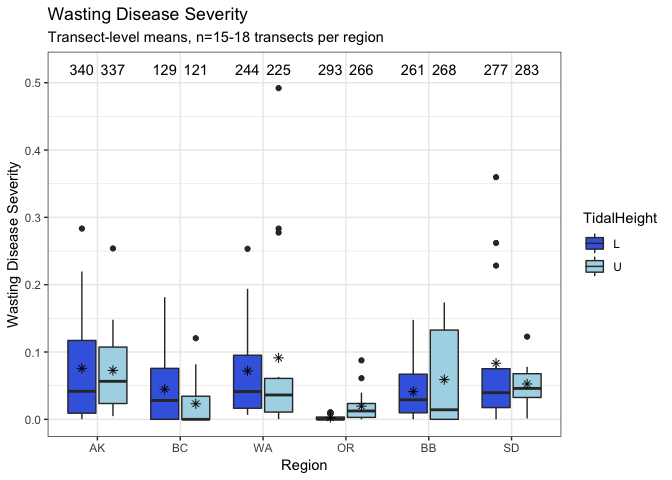

ExploratoryPrevSev
================
LRA
1/13/2020

## Exploratory analysis of wasting disease prevalence and severity from 2019 intertidal surveys

These plots show WD prevalence and severity based on a subset of the
Eelisa output. Once the full output is available, I will update the
plots and
analysis.

### Summary table of transect-level prevalence and severity by tidal height within region

    ## # A tibble: 12 x 6
    ## # Groups:   Region [?]
    ##    Region TidalHeight   prev     sev lesion count
    ##    <ord>  <chr>        <dbl>   <dbl>  <dbl> <int>
    ##  1 AK     L           0.518  0.0740  108.     340
    ##  2 AK     U           0.588  0.0756   88.7    337
    ##  3 BC     L           0.202  0.0432   53.2    129
    ##  4 BC     U           0.107  0.0304   28.3    121
    ##  5 WA     L           0.689  0.0790  350.     244
    ##  6 WA     U           0.582  0.0891  281.     225
    ##  7 OR     L           0.0922 0.00274   5.07   293
    ##  8 OR     U           0.188  0.0204   21.1    266
    ##  9 BB     L           0.418  0.0470  115.     261
    ## 10 BB     U           0.410  0.0689  136.     268
    ## 11 SD     L           0.412  0.0898   14.9    277
    ## 12 SD     U           0.371  0.0549    7.43   283

### Plot of transect-level prevalence

<!-- -->

This plot shows the distributions of transect-level prevalence by tidal
height in each region. The black bar in the box-plot indicates the
median prevalence, the X indicates the mean. Numbers at the top of the
plot indicate the number of measurements for each box-plot. Note that
the total number of shoots per tidal height should be 300 for BC, WA,
OR, and SD and 360 for AK and BB. More measurements will be added when
the complete Eelisa output is available.

Interesting pattern: AK and WA have mean prevalence above 50%, BB and SD
have prevalence between 25 and 50% and BC and OR have mean prevalence
below 25%. A lot of variability, especially in BB.

### Plot of transect-level severity

<!-- -->

Similar to above, this plot shows transect-level severity by tidal
height within region. The black bar in the box-plot indicates the median
prevalence, the X indicates the mean. Numbers at the top of the plot
indicate the number of measurements for each box-plot. Note that the
total number of shoots per tidal height should be 300 for BC, WA, OR,
and SD and 360 for AK and BB. More measurements will be added when the
complete Eelisa output is available.

The regions are less differentiated, but we see a similar pattern -
lowest severity at BC and OR, highest at AK and WA.
