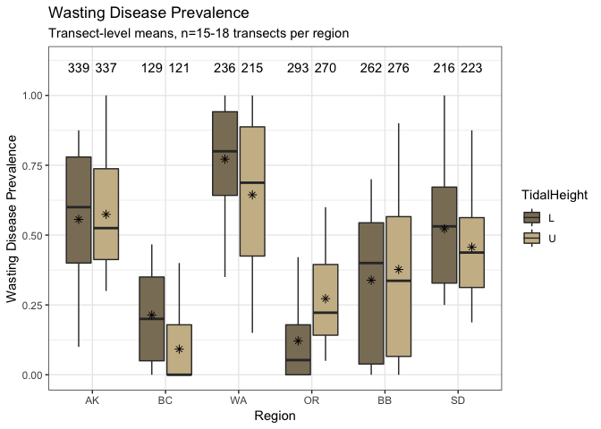
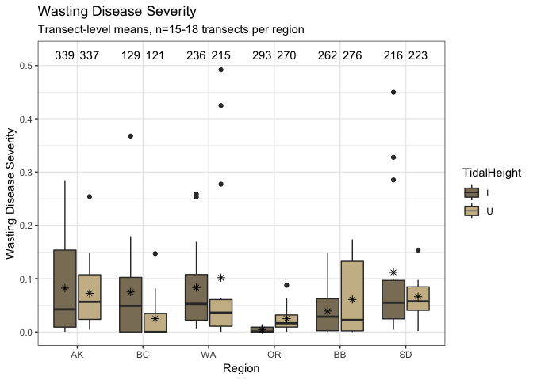
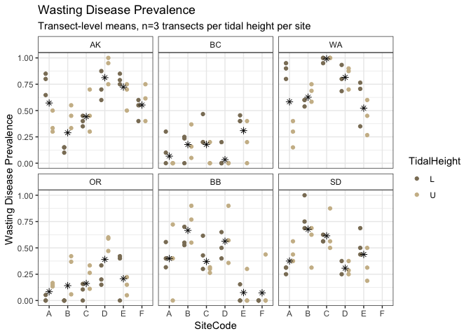
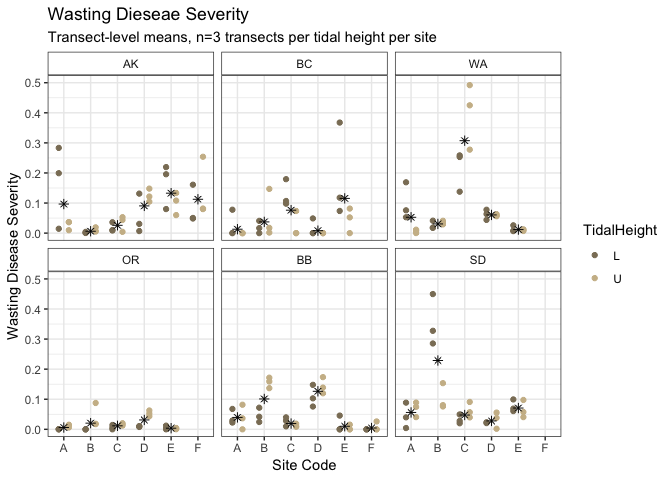

Measured Disease Data
================
LRA
3/4/2020

## Wasting Disease Data

This is an analysis of wasting disease prevalence and severity from the
NSF surveys in 2019, as available in March 2020.

This is the final data set, with 3702 blades from
    2019.

    ##    Region TidalHeight prevM    sevM lesion count prevSD prevSE sevSD
    ## 1      AK           L  0.56 0.07782  124.5   360   0.50  0.026 0.145
    ## 2      AK           U  0.64 0.07490   95.1   360   0.48  0.025 0.122
    ## 3      BC           L  0.41 0.05013  132.3   300   0.49  0.028 0.120
    ## 4      BC           U  0.28 0.03817   52.6   299   0.45  0.026 0.121
    ## 5      WA           L  0.78 0.07833  349.6   299   0.42  0.024 0.114
    ## 6      WA           U  0.65 0.10457  324.2   293   0.48  0.028 0.177
    ## 7      OR           L  0.12 0.00024    7.4   298   0.33  0.019 0.002
    ## 8      OR           U  0.30 0.00367   32.4   298   0.46  0.027 0.014
    ## 9      BB           L  0.69 0.03530  206.9   360   0.46  0.024 0.071
    ## 10     BB           U  0.73 0.03979  174.2   357   0.45  0.024 0.071
    ## 11     SD           L  0.57 0.10342   18.6   239   0.50  0.032 0.190
    ## 12     SD           U  0.49 0.07047    9.6   239   0.50  0.032 0.143
    ##      sevSE
    ## 1  0.00763
    ## 2  0.00645
    ## 3  0.00692
    ## 4  0.00702
    ## 5  0.00658
    ## 6  0.01036
    ## 7  0.00012
    ## 8  0.00081
    ## 9  0.00372
    ## 10 0.00377
    ## 11 0.01232
    ## 12 0.00927

### Transect-level prevalence

<!-- -->

### Transect-level severity

<!-- -->

### Transect-level prevalence, broken down by site

<!-- -->

### Transect-level severity, broken down by site

    ## Warning: Removed 1 rows containing non-finite values (stat_summary).

    ## Warning: Removed 1 rows containing missing values (geom_point).

<!-- -->
