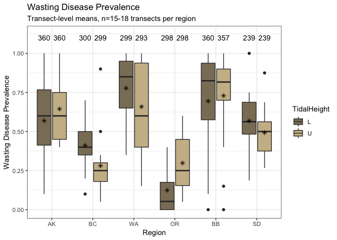
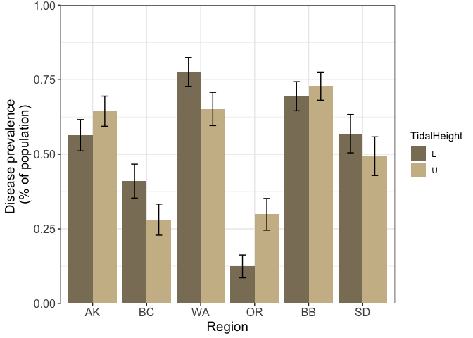
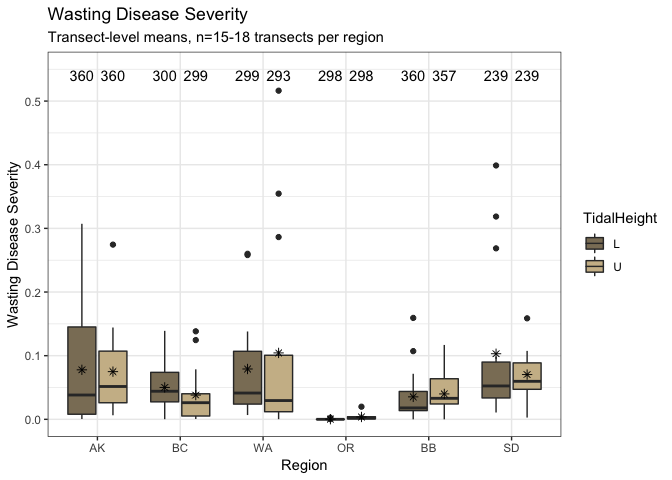
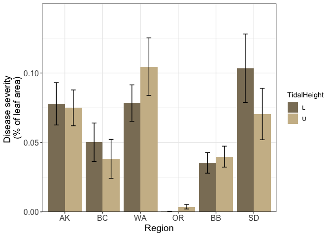
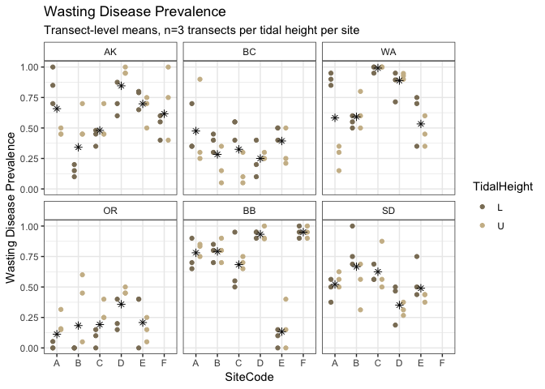
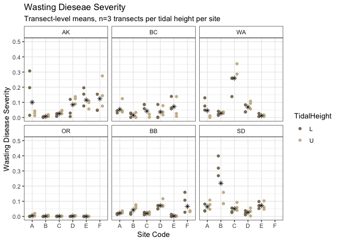

CleanedOutputTidalHeight
================
LRA
3/4/2020

### Transect-level prevalence

<!-- -->

Also include prevalence as a bar plot, for an alternative visualization

<!-- -->

### Transect-level severity

<!-- -->

Also include severity as a bar plot, for an alternative visualization

<!-- -->

### Transect-level prevalence, broken down by site

<!-- -->

### Transect-level severity, broken down by site

<!-- -->
